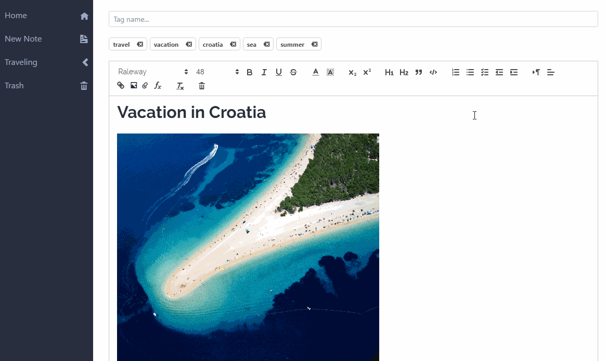
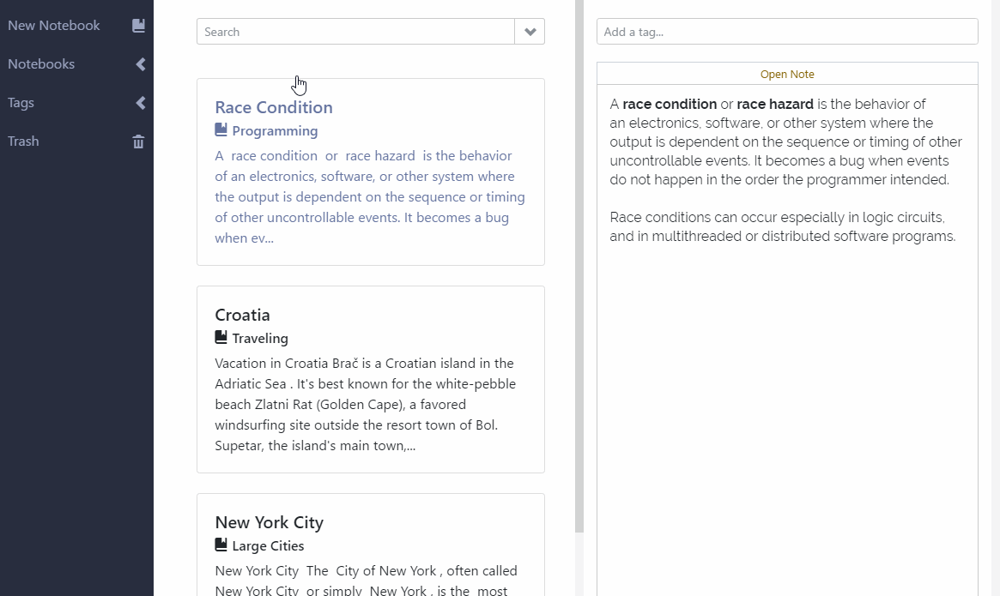
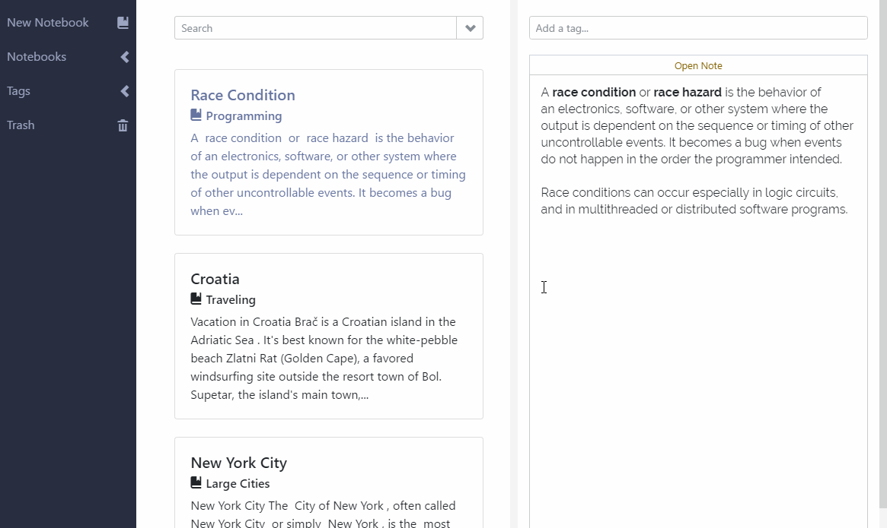
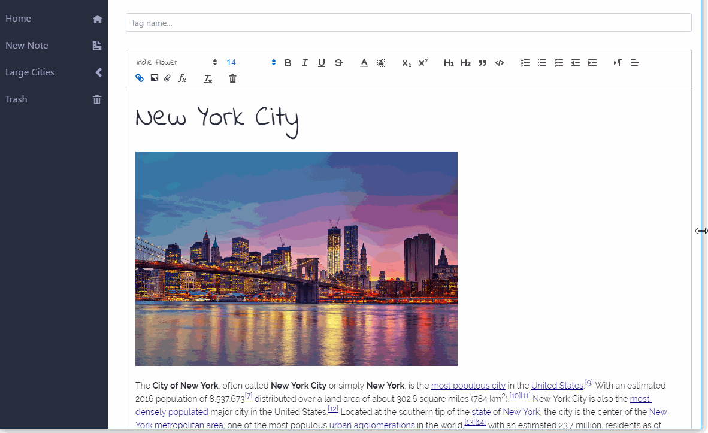
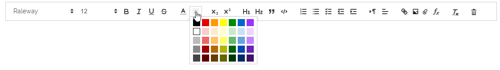

# MonteNote

Note taking application with a rich set of editing and management features.

## Note Page

## Search Note Content

## Preview Notes

## Responsive Design

## Other Features

- Note content gets autosaved
- Add custom tags to notes
- Attach any type of data to a note
- Easily open attachments
- Add and resize images
- A selection of popular web fonts for you to choose
- Rich text editing capabilities

- Import note content with ease
- Localized note content
- No 3rd party login requirement for you to access the app (tsk, tsk)

## Setup

Windows:

Linux:

## In the Future:

- Extend test case coverage
- Export notes to PDF
- Table creation
- Add more keyboard shortcuts
- Package the application for Mac

## Stack:

- [Electron](https://github.com/electron/electron)
- [React](https://github.com/facebook/react)
- [Redux](https://github.com/reactjs/redux)
- [Quill](https://github.com/quilljs/quill)

